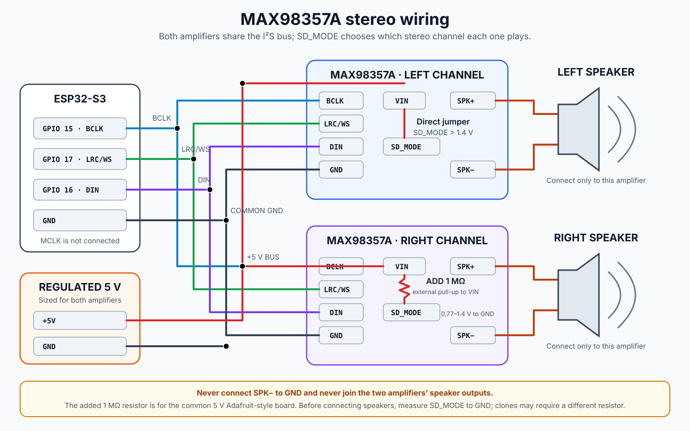

# Radiohead ESP32 Internet Radio

PlatformIO firmware for an ESP32-S3 internet radio with a TFT display, web controls,
station playlists, podcasts, weather, alarms, audio settings, and OTA updates.

## Application layout

- `src/main.cpp` coordinates startup and the main device loop.
- `src/app_state.cpp` owns shared hardware objects and application state.
- `src/media.cpp` handles stations, M3U playlists, podcasts, and audio metadata.
- `src/settings.cpp` persists user configuration with `Preferences`.
- `src/display.cpp` owns colors, weather rendering, Wi-Fi status, spectrum, and VU drawing.
- `src/device_control.cpp` handles the encoder task, sleep, and factory reset.
- `src/web_server.cpp` owns web pages, request validation, routes, uploads, and OTA handling.
- `include/` contains the public interface for each module.

The bundled `lib/ESP32-audioI2S-master` directory is third-party code and remains
separate from the application modules.

The [framework consolidation plan](docs/framework-consolidation-plan.md) recommends
one authoritative ESP-IDF build, retaining Arduino as a component. Implementation
and device validation of that consolidation are pending.

## Encoder wiring and controls

The radio has **one physical button: the encoder's push switch**. Disconnect power
before wiring. These are ESP32-S3 GPIO numbers, not physical header positions.

| Encoder module pin | ESP32-S3 connection |
| --- | --- |
| `+` / `VCC` | **3.3 V**, not 5 V |
| `GND` | Common GND |
| `CLK` / `A` | GPIO 4 (`PIN_A`) |
| `DT` / `B` | GPIO 5 (`PIN_B`) |
| `SW` | GPIO 7 (`PIN_SW`) |

Encoder modules may pull their signal pins up to VCC. Use 3.3 V so these signals
stay within the ESP32-S3's input limits; its GPIOs are not 5 V tolerant. See the
[Espressif datasheet](https://documentation.espressif.com/esp32_s3_datasheet_en.pdf).
A bare mechanical encoder needs no VCC connection: connect its rotary common and
one switch contact to GND, A/B to GPIO 4/5, and the other switch contact to GPIO 7.
The firmware enables internal pull-ups.

- Turn to change volume; short-click to mute/unmute.
- Hold the switch while powering on or resetting to request Wi-Fi setup/recovery.
  Boot checks for a pressed switch, without a timed hold threshold. Release after
  setup mode starts. This does not start touch calibration.
- During normal operation, a hold of approximately 700 ms requests sleep.

Leave GPIO 6 (`PIN_K0`) disconnected for this one-button wiring. **Current firmware
limitation:** deep-sleep wake still uses GPIO 6, so the encoder on GPIO 7 cannot
yet wake the radio from deep sleep. Moving wake to GPIO 7 and retiring the old K0
sleep/factory-reset handler remains firmware work. Do not bridge GPIO 6 and 7.

The future [battery power plan](docs/hardware/battery-power-architecture-plan.md)
also uses this one switch and GPIO 7, through an adapted BSS138 interface to the
IP5310 KEY input. It replaces the relay proposal. That circuit requires different
switch wiring and bench validation; its software shutdown sequence is not yet
implemented.

## Stereo speakers

The firmware already sends stereo audio on the I2S bus. Two mono MAX98357A
amplifiers share the same BCLK, LRC/WS, and DIN signals; their `SD_MODE` wiring
selects left or right audio.

With power disconnected, wire the two MAX98357A boards as follows:

| Connection | Left amplifier | Right amplifier |
| --- | --- | --- |
| Regulated 5 V supply | `VIN` | `VIN` |
| Common GND with ESP32-S3 | `GND` | `GND` |
| GPIO 15 (`I2S_BCK`) | `BCLK` | `BCLK` |
| GPIO 17 (`I2S_LRC`) | `LRC` / `WS` | `LRC` / `WS` |
| GPIO 16 (`I2S_DIN`, ESP32 data output) | `DIN` | `DIN` |
| Gain selection | Leave `GAIN` unconnected | Leave `GAIN` unconnected |
| Speaker terminals | Left speaker to this board's `SPK+` / `SPK-` | Right speaker to this board's `SPK+` / `SPK-` |

The amps accept the ESP32's 3.3 V I2S signals while powered from 5 V. No MCLK is
needed. Use a supply and wiring sized for both amps plus the radio, and keep I2S
wires short. Use speakers rated at least 4 ohms with a suitable power rating.
Unconnected `GAIN` selects the default 9 dB gain. See the
[Adafruit MAX98357A pinout guide](https://learn.adafruit.com/adafruit-max98357-i2s-class-d-mono-amp/pinouts).

For common **Adafruit-style boards powered at 5 V**:

- Left amp: connect `SD` / `SD_MODE` directly to its `VIN`.
- Right amp: connect `SD` / `SD_MODE` to its `VIN` through an **additional 1 MΩ
  resistor**, retaining the board's existing pull-up.

Before attaching speakers, measure `SD` to GND: left must be above 1.4 V; right
must be between 0.77 and 1.4 V. Clone pull-ups can differ, so choose the resistor
for the measured voltage if needed. Then test channel separation at low volume
using known left/right audio. Electrical and playback checks remain on-device
verification; this table does not claim they have been performed.



The diagram shows the additional 1 MΩ pull-up used to select the right channel on
the common 5 V Adafruit-style board. See the
[MAX98357A stereo wiring notes](docs/hardware/max98357a-stereo.md) before connecting
the second amplifier or using a different breakout. The speaker outputs are
bridge-tied and must not be connected together or to ground.

## Build

```sh
python3 tools/build_firmware.py
# Equivalent PlatformIO convenience target:
pio run -e esp32s3
```

The complete firmware is compiled once through ESP-IDF 5.5.5 / CMake, with
Arduino-ESP32 3.3.11 as a component and Spotify included. PlatformIO installs
the pinned toolchain and libraries; it does not compile a second application.
The entry command also prepares the pinned cspot/Bell candidate and generates
UI assets. Asset generation currently requires macOS `sips`, `xxd`, and Swift.
Python 3, PlatformIO and Git must be installed; the first build needs network
access for dependencies. Framework updates remain a separate change.

The OTA application stays at `.pio/build/esp32s3/firmware.bin`. Matching factory,
ELF, bootloader, partition and initial OTA images plus `artifacts.json` are
exported from the same native build. Flash an existing build with:

```sh
~/.platformio/penv/bin/python tools/flash_built_firmware.py --port /dev/cu.usbmodem11201
```

`pio run -e esp32s3 -t upload` builds then uses the same validated uploader.
It writes the bootloader, partition table, initial OTA selection and app0,
preserving NVS, LittleFS and app1. `--dry-run` prints that command without
opening the serial port. `pio run -e esp32s3 -t clean` removes the default native
build and exported artifacts. Use a fresh `--build-dir` after changing component
paths or configuration defaults; `--output-dir` can isolate comparison artifacts.
See the [consolidation verification record](docs/framework-consolidation-validation.md)
for build evidence, baseline recovery artifacts and pending physical-device checks.

## Switch boot screens over HTTP

Both screens are included in the firmware. The selection is stored on the device
and takes effect after restart. Mode `0` is the original screen; mode `1` is the
new artwork and the default.

Select the original screen:

```sh
curl -X POST http://radio.local/api/device/boot-mode \
  -H 'X-Radiohead-Config: 1' --data 'mode=0'
```

Select the new screen:

```sh
curl -X POST http://radio.local/api/device/boot-mode \
  -H 'X-Radiohead-Config: 1' --data 'mode=1'
```

After a successful save, restart to apply it (playback stops during reboot):

```sh
curl -X POST http://radio.local/api/device/restart
```

Check the active and saved modes with
`curl http://radio.local/api/device/boot-mode`. If `radio.local` does not resolve,
replace it with the radio's displayed IP address. See
[persisted boot modes](docs/boot-modes.md) for response fields and reset behavior.

## TFT display and touch wiring

The firmware uses a **240 × 320 ILI9341 SPI TFT with an XPT2046 resistive-touch
controller**, displayed in **320 × 240 landscape** orientation. The connections below
match the pin constants in [include/app_state.h](include/app_state.h) and the
LovyanGFX configuration in [src/app_state.cpp](src/app_state.cpp). Numbers refer to
ESP32-S3 **GPIO numbers**, not physical header positions. The table records the
owner's working wiring in the actual TFT header order.

Disconnect power before wiring. This device's TFT `VCC` is connected to **5 V DC**;
its signal connections use **3.3 V logic**. Display, touch controller, ESP32-S3, and
audio hardware share a common ground. The pin order matches the
[LCDWIKI MSP2807 interface](https://www.lcdwiki.com/2.8inch_SPI_Module_ILI9341_SKU:MSP2807),
which specifies 3.3–5 V power, 3.3 V logic, and optional display `SDO`. The exact
module model has not been confirmed, so verify the supply rating before using this
wiring with a replacement panel. A 5 V module supply does not mean 5 V GPIO signals.
ESP32-S3 electrical limits are documented in the
[Espressif datasheet](https://documentation.espressif.com/esp32_s3_datasheet_en.pdf).

### Complete header wiring, in pin order

| Header position | TFT module pin | ESP32-S3 connection | Function |
| ---: | --- | --- | --- |
| 1 | `VCC` | 5 V DC supply | Module power; owner's working connection |
| 2 | `GND` | `GND` | Common ground |
| 3 | `CS` | GPIO 8 | Display chip select (`TFT_CS`) |
| 4 | `RESET` | GPIO 10 | Display reset (`TFT_RST`) |
| 5 | `DC` | GPIO 9 | Data/command select (`TFT_DC`) |
| 6 | `SDI(MOSI)` | GPIO 11 | SPI data from ESP32-S3 (`TFT_MOSI`) |
| 7 | `SCK` | GPIO 12 | SPI clock (`TFT_SCLK`) |
| 8 | `LED` | GPIO 3 | Backlight PWM (`TFT_BLK`); owner's working connection |
| 9 | `SDO(MISO)` | **Not connected** | Display readback; not needed by the current application |
| 10 | `T_CLK` | GPIO 12 | Touch clock, shared with display `SCK` |
| 11 | `T_CS` | GPIO 14 | Separate touch chip select (`TOUCH_CS`) |
| 12 | `T_DIN` | GPIO 11 | Touch data in, shared with display `SDI(MOSI)` |
| 13 | `T_DO` | GPIO 13 | Touch data out to ESP32-S3 (`TFT_MISO`) |
| 14 | `T_IRQ` | **Not connected** | Touch interrupt; firmware uses polling |

Despite the constant name `TFT_MISO`, GPIO 13 receives **touch data from `T_DO`**
in this wiring. Display `SDO(MISO)` remains disconnected. Current display rendering
does not read pixels or registers back from the physical TFT; pixel reads in the
renderer use its in-memory canvas. Keep `T_DO` connected for touch to work.

The firmware drives GPIO 3 with active-high, 5 kHz PWM for brightness, automatic
dimming, and backlight shutdown during sleep. Connect it directly only if the module
provides a 3.3 V compatible backlight control input. If `LED` is a backlight power
terminal, use an appropriate current-limited LED driver with an active-high PWM
input driven by GPIO 3; do not assume a GPIO can supply the backlight current.
Backlight pin circuitry varies by breakout; for example, Adafruit documents a PWM
control input on its
[ILI9341 breakout](https://learn.adafruit.com/adafruit-2-4-color-tft-touchscreen-breakout/pinouts).
Tying the backlight permanently to the supply bypasses firmware dimming and shutdown.

Both controllers share the SPI2 clock and outgoing data lines, with separate chip
selects. The return line is connected only to the touch controller:

```text
ESP32-S3 GPIO 12 ──┬── TFT SCK
                  └── Touch T_CLK
ESP32-S3 GPIO 11 ──┬── TFT SDI (MOSI)
                  └── Touch T_DIN
ESP32-S3 GPIO 13 ───── Touch T_DO
ESP32-S3 GPIO  8 ───── TFT CS
ESP32-S3 GPIO 14 ───── Touch T_CS
TFT SDO (MISO)  ────── Not connected
Touch T_IRQ     ────── Not connected
```

Keep `CS` and `T_CS` separate. Pins on a module's optional microSD connector
(`SD_CS`, `SD_SCK`, `SD_MOSI`, `SD_MISO`) are not used by this firmware and should
be left unconnected. `SDI` and `SDO` in the display table are TFT data pins, not
microSD connections. This wiring requires an SPI display and XPT2046 controller;
raw resistive-touch terminals (`X+`, `X-`, `Y+`, `Y-`) are not substitutes for the
`T_*` pins.

### Touch calibration and diagnostics

On the radio, open **Settings → Device → Touch calibration**, then tap and release
each of the four corner markers. The raw coordinates are printed at 115200 baud and
saved in NVS, then loaded automatically on later boots. Without saved calibration,
the firmware uses its default touch mapping. Repeat calibration after replacing or
rotating the screen.

Normal firmware polls touch but leaves diagnostic output disabled.

### Low-sensitivity test

Keep the working wiring above for the baseline. There is no established sensitivity
benefit from connecting display `SDO` or touch `T_IRQ`: the former supplies display
readback, and the latter is unused by the current polling implementation. The touch
driver already uses 250 kHz sampling, same-axis settling, and coordinate validation
without a pressure threshold.

1. Wake the screen and complete calibration if taps land in the wrong place.
2. At the same button, compare 10 comfortable light finger-pad taps with 10 gentle
   fingernail taps. Lift fully for at least half a second between taps. Count attempts
   and actual button actions separately. Repeat at the center and near the edges.
3. If light finger-pad taps fail while fingernail taps work, inspect any removable
   shipping film and whether the enclosure presses on the panel. With power off,
   check touch jumper contacts and shorten unnecessarily long SPI/ground wires.
   Change one thing at a time and repeat the same trial. Do not peel the bonded
   resistive touch layer or press harder to count a light tap as successful.
4. For ADC and input-event evidence, follow
   [the touch diagnostic capture procedure](docs/ui/touch-diagnosis.md). It compares
   idle, fingernail, light-pad, and firm-pad captures using the existing
   `TOUCH_DEBUG_ENABLED=1` reports (`TouchADC` and `Touch polls=`). These counters
   describe coordinates and events, not measured physical pressure.

The owner has confirmed this wiring works. Comfortable finger-pad sensitivity
remains unresolved; no new physical trial or electrical measurement is implied by
this documentation update.
