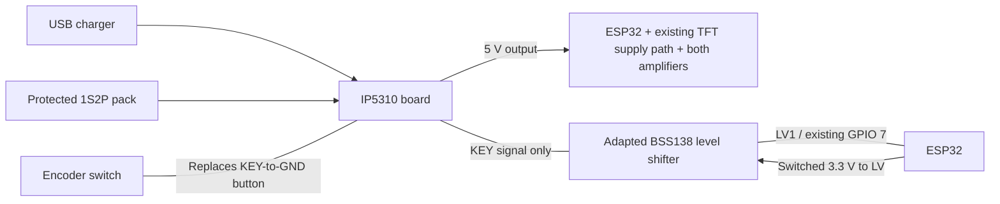

# Simple battery power plan

Updated: 2026-10-06. Proposed circuit for bench validation; not electrically tested.

## Decisions

The user waived **off while charging** and accepted **double-click to turn off**.
Use a ready-made **IP5310 USB-C charger / 5 V power-bank board**, with the encoder
switch replacing its button. Add one small **BSS138 bidirectional level-shifter
board**, adapted below, between that button and the ESP32.

This replaces the relay investigation and off-while-charging acceptance gates.
No relay, HOLD signal, separate boost converter, I2C PMIC variant or custom
power-controller PCB is planned. The older
[candidate evaluation](battery-power-candidate-evaluation.md) is historical.

The previously linked board is IP5310. A suitable IP5210 board/datasheet was not
identified in this search; do not assume the two names mean the same chip.

## Intended operation

| Action | Result |
| --- | --- |
| Press encoder while off | Board enables the radio supply. Release normally; no firmware HOLD takeover is needed. |
| Turn encoder while running | Volume changes as today. |
| Single click while running | Firmware toggles mute. |
| Two short clicks within one second, on battery | Board shuts down directly: a hardware power cut. |
| Firmware shutdown request, on battery | Finish saves, stop playback, then imitate two button presses through the level shifter. |
| USB charger connected | Charging and a powered radio are allowed. Off requests may leave power on; standby is acceptable and must not be labelled electrical off. |

The [manufacturer's IP5310 datasheet, pages 9 and 13](https://www.injoinic.com/api/static/uploads/20250528/20250528180445_6836dfbd54166.pdf)
documents short-press wake, two short presses within one second for boost-off,
and a KEY-to-BAT 10 kohm option that disables double presses. Select the ordinary
double-click-enabled configuration. Long holds control the optional flashlight
at chip level; they are not the chip's normal shutdown gesture.
[Readable mirror](https://wiki.geekworm.com/images/c/ce/IP5310-datasheet-en.pdf).

Physical double-click can cut power before firmware saves anything and bypasses
the OTA guard. Use stable USB charging power for OTA, first verify that this
board cannot interrupt its output on double-click while USB is present, and
avoid the physical power gesture during updates. Firmware-generated shutdown
must still defer during writes. Firmware cannot override a directly wired button.

## Power wiring



- Two matched conventional 4.2 V Li-ion cells form **1S2P**, never 2S. Use a
  protected pack or suitable 1S protection if the module lacks the required pack
  protection. Establish cell model, current rating, matching and equal voltage
  before paralleling; 3500 mAh alone does not establish suitability.
- Pack output connects to the identified battery pads. USB charging connects to
  the module's charging port, not the ESP32 programming connector.
- Fixed **5 V output** supplies the devboard's verified 5 V input, both amplifiers
  and the TFT's existing appropriate supply path. Do not move a 3.3 V-only TFT
  connection to 5 V.
- All grounds are common. Speaker terminals remain on their individual amplifier
  outputs; neither speaker terminal is ground.
- Size protection, fuse, holder, connectors and wires for measured peak battery
  current. Advertised 3.1 A is not a measured continuous rating of the assembled
  module. Test both amplifiers at the intended volume.

## Replacing the button and connecting the ESP32

Use the encoder's **two switch contacts**, not rotary A/B. Remove the old direct
switch-to-GPIO-7 connection. On an encoder breakout, check for a SW pull-up or
LED and isolate that circuitry from KEY. Rotary A/B wiring stays as it is.

With power removed, identify the original button's switched pair and GND.
Four-leg tactile switches have internally connected pairs; do not choose by
position. Remove the button if desired and put the encoder switch across KEY/GND.

Choose a simple four-MOSFET BSS138 level-shifter board, not a TXB/TXS converter
or an older mixed resistor-divider board. The
[SparkFun reference schematic](https://cdn.sparkfun.com/datasheets/BreakoutBoards/Logic_Level_Bidirectional.pdf)
shows one MOSFET and two pull-ups per channel. Confirm that topology on the
actual AliExpress board.

| Connection | Destination |
| --- | --- |
| Encoder switch contact 1 | IP5310 KEY button pad |
| Encoder switch contact 2 | IP5310 button GND pad |
| Level shifter HV1 | Same KEY pad |
| Level shifter LV1 | Existing ESP32 GPIO 7 (`PIN_SW`) |
| Level shifter LV supply | ESP32's switched 3.3 V rail |
| Level shifter GND | Common GND |
| Level shifter HV supply and unused channels | Unconnected after the modification below |

**Remove the HV1-to-HV pull-up resistor** (usually 10 kohm). Keep the LV1-to-LV
pull-up and MOSFET. Identify the resistor by continuity, not an assumed clone
reference designator. Do not connect HV to BAT or 5 V. IP5310 supplies its own KEY
bias; adding 10 kohm to BAT can disable double-click shutdown. Removing this
resistor also separates KEY from the unused channels' shared HV pull-up network.

Resulting signal circuit:

```text
ESP32 switched 3.3 V ----+---- existing 10k ---- GPIO 7 / LV1
                        |                         |
                        +---- BSS138 gate         +-- source
                                                      drain ---- KEY ---- switch ---- GND
                                                                 |
                                                  IP5310's original KEY circuitry
```

GPIO 7 normally remains an input. For a simulated press, pull LOW; for release,
return to high impedance. **Never drive HIGH push-pull.** One channel handles
sensing and shutdown without a new GPIO.

This adaptation needs bench verification. The MOSFET principle transfers LOW in
either direction and isolates the unpowered low side in the standard application.
[NXP AN10441](https://cdn-shop.adafruit.com/datasheets/AN10441.pdf).
KEY is not a standard I2C bus: measure its bias with and without this interface.
Near empty battery KEY may be below 3.3 V, outside the reference application's
normal supply ordering. Verify that the LV pull-up/body-diode path does not
change key classification or inject unacceptable current. This check is required
before final assembly; the circuit is not represented as manufacturer-validated.

## AliExpress parts shortlist

Purchasing leads, not verified live variants or current prices. No purchases or
basket changes were made.

| Qty | Part | Lead / selection |
| --- | --- | --- |
| 1 | IP5310 USB-C charger, fixed 5 V output, button and battery pads | [Original candidate](https://www.aliexpress.com/item/1005008291016827.html); select IP5310 3.1 A, not a different option sharing the listing. [Alternative lead](https://www.aliexpress.com/item/1005008721553379.html). |
| 1 | Four-channel BSS138 bidirectional logic level converter | [AliExpress lead](https://www.aliexpress.com/item/1005012826711321.html). Confirm four discrete MOSFETs, LV/HV/grounds and individually accessible pull-ups. Use one channel. |
| As needed | Suitable 1S2P holder/pack protection, fuse, wire and insulation | Check existing parts. Holder must be parallel; protection/charge limits must match the cells and measured current. |

Module leads were found in indexed records:
[IP5310](https://www.pricearchive.org/aliexpress.com/item/1005008291016827),
[level converter](https://www.pricearchive.org/aliexpress.com/item/1005012826711321).
Seller variant, delivery, protection and exact PCB remain unverified. Previous
AliExpress browser restrictions were not bypassed.

## Firmware work after bench validation

1. Consume the power-on press through release: no mute, sleep, Wi-Fi setup or
   calibration from that press. Preserve deliberate recovery, proposed as
   release then a fresh hold in a recovery window.
2. Keep volume and single-click mute. Retain the 700 ms long-press request but
   wait for release before software shutdown. Physical double-click is the
   accepted immediate-off shortcut; the first click may briefly mute before off.
3. Save settings and quiesce storage/audio before software shutdown. Keep the
   loop responsive and suppress interpretation of generated button events.
4. After at least 1.2 seconds of released-button quiet time, try two LOW pulses
   of 350 ms separated by 150 ms released, then release GPIO 7. These are initial
   bench timings, not validated values. Restart the quiet interval if the user
   presses before the sequence. Test power collapse during pulse two and require
   the board to remain off with the radio attached.
5. If power remains, release the signal and use awake, silent/dim standby with
   input/web service. Do not retry forever or claim electrical off. This avoids
   a separate source-detection board, but cannot distinguish USB power from a
   failed shutdown; report that honestly. Encoder input can leave standby.
   Review K0 and `/off` consistently.
6. `taskControl()` currently configures GPIO 7 as an input. It must not race the
   shutdown sequence's pin-mode changes. Centralize pin ownership in
   `device_control`; keep startup coordination in `main`.

There is no HOLD pin to preserve through reset. Verify the PMIC does not time out
during reboot, quiet standby or calibration. Existing recovery stays until its
replacement is implemented and tested.

## Short bench checklist

1. Board alone: identify pads and cell-charge configuration. With a suitable
   load and USB absent, verify single-press on and double-press off **with the
   load left connected**. Measure output collapse and verify it stays off.
2. Add the adapted shifter: confirm valid GPIO LOW/HIGH at full and low battery,
   unchanged KEY mode, and GPIO/3.3 V isolation while off. No powered programming
   USB cable during off tests.
3. Check software pulses, startup press, reset and clicks. Insert/remove charger
   USB and verify accepted powered behavior. Confirm charging-powered OTA cannot
   be interrupted by PMIC button shutdown.
4. Test actual ESP32, TFT and both amplifiers: startup, loud playback, muted/dim
   operation, low battery, rail stability, temperature and total off current.

Plan and shortlist prepared. Exact module qualification, firmware, final physical
wiring diagram and hardware acceptance remain outstanding. No firmware changes,
build, flash or electrical tests were performed in this planning pass.
