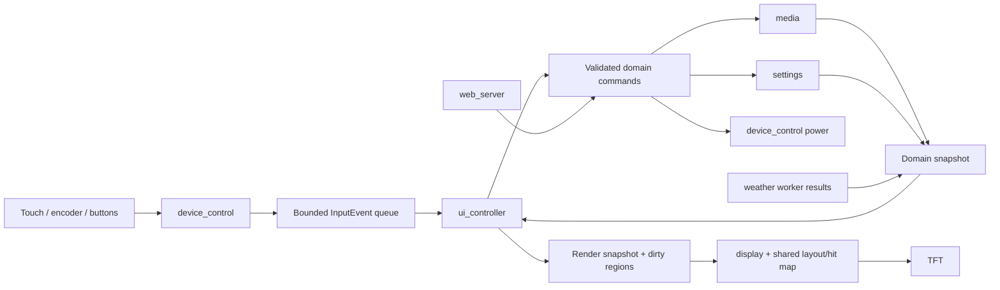

# Radiohead UI concept: agent implementation guide

Status: implementation plan, not a claim that these features exist.
Reference inspected: **[uiconcept.png](uiconcept.png)**, 1448 × 1086, a contact sheet
of 16 screens. This is the file referred to as `ui-concept.png` in the request.
Target: the project's **2.8-inch ILI9341 TFT, 320 × 240 landscape**, XPT2046 touch,
and rotary encoder with push. Plan prepared against the September 2026 worktree.

## 1. Instructions for every implementing agent

1. Read [AGENTS.md](../../AGENTS.md), the local `radiohead-firmware` and
   `typesafe-ai` skills, this guide, and the relevant module headers, source, and
   direct callers. Inspect `git status --short` and the overlapping diff first.
2. Use the contact sheet as the **visual and navigation reference**. The earlier
   [interaction-plan.md](interaction-plan.md) and `radio-ui.html` are a different
   visual direction. Do not silently substitute their paper/olive design for this
   sunset/blue concept. This guide supersedes their conflicting visual choices.
3. Implement one bounded work package from section 10. State its inputs, files,
   acceptance checks, and dependencies before editing. Leave the next package a
   buildable result; do not implement all sixteen screens as one change.
4. Distinguish working functionality from a static design fixture. A reference
   image does not prove font rendering, live layout, input, animations, network
   behavior, or audio stability.
5. Preserve current pins, Preferences keys, web routes, audio volume mapping,
   alarms, calibration, and OTA behavior unless the package explicitly changes
   that behavior. Document intentional changes; do not hide them inside refactoring.
6. Keep arithmetic, bounds, state transitions, hit testing, time and side effects
   deterministic. Jev could review requirement coverage but is unnecessary in the
   firmware. No AI SDK, credential, paid call, or runtime dependency is needed.
7. Build after code/config changes, check RAM/flash, inspect the diff, and report
   exactly what was tested on hardware. Do not edit vendored audio code.

There is no static-image presentation firmware. Keep the reference images as source
material and use native C++ render fixtures when validating layouts. The display
module retains a generic in-memory PNG asset renderer for future prepared backgrounds
and artwork; no concept image is embedded or shown by normal firmware.

## 2. Read the concept correctly

The sheet depicts a complete product, not one screen to scale onto the TFT.
Each numbered panel becomes a separate page or overlay. Remove contact-sheet
borders, gutters and captions when preparing a visual fixture. Do not scale the
entire contact sheet to the TFT and call that a UI test.

Preserve these characteristics:

- Coastal sunset/city background, dark navy surfaces, white text and blue focus.
- Large weather and clock on Home; four labeled destinations.
- Compact shared page header with Back, title, time and connection state.
- Artwork plus primary/secondary metadata; restrained dividers and rounded rows.
- Blue selected row, a separate favorite indicator, clear transport symbols.
- Hebrew show names and programme metadata alongside Latin station names/numbers.

Adapt details where physical usability requires it:

- Use **three 48 px list rows**, not five tiny rows. Retain the visual hierarchy
   with paging/scrolling. Four or five rows are an optional later density setting,
   contingent on finger testing; they are not the initial implementation target.
- Make the star's hit region 44 × 44 even if its drawing is 18–22 px. Keep its
   target disjoint from the row's play/open target.
- Darken the image behind text. Use cached/precomposed dark surfaces instead of
   recalculating blur, transparency or shadows on every frame.
- Preserve the four Home colors as muted category accents. Selected/focused must
   also have a border/marker; color alone is insufficient.
- Remove the Home slogan before reducing essential text sizes. It is decorative.
- Treat `14:37`, `28°`, `70`, programme dates, station descriptions, `88.8 FM`,
   Tel Aviv, logos and portraits as **sample content**, not authoritative data.
  This hardware plays internet streams; an FM frequency is optional catalog
   metadata, not a tuner state. Never fabricate missing values.

### Screen inventory and implementation scope

| # / reference panel | Required behavior | Current support and planned work |
| --- | --- | --- |
| 1 Home | Clock/date/weather; Live Radio, Recorded Shows, Favorites, Settings; weather opens detail | Time and basic weather exist. Add page/navigation; keep playback alive behind it. Add a visible return-to-player action when listening. |
| 2 Live Stations List | Browse valid stations, show artwork/title, select to play, toggle favorite | Ten mutable station slots exist. New list, focus, assets and favorite storage. Hide empty slots without changing underlying slot indexes. |
| 3 Now Playing (Live) | Source/status, station/programme, previous/stop/next, volume, favorite/options | Playback exists. Add explicit state and shared commands. Stop means stop; restarting rejoins the live stream. No rewind/time-shift promise. |
| 4 Station Options | Favorite, station information, website/share handoff | New page. Information requires catalog metadata. Website/share open a phone handoff, not a browser or share sheet on the ESP32. |
| 5 Recorded Shows List | Select show to fetch episodes; retain page/focus on Back | Ten show definitions exist, with Latin TFT aliases. Artwork/latest episode summaries are new data; omit unavailable summaries. |
| 6 Show Episodes | Loading/result/empty/error states; select episode to play | Up to eight fetched episodes exist. Duration is not currently stored. Do not manufacture it or imply pagination beyond fetched items. |
| 7 Playing Recorded Show | Artwork/title, elapsed/duration, pause, −15/+30, progress | Installed audio header exposes timing/pause/relative seek methods. Support varies by stream/file/server; verify before enabling each control. |
| 8 Show Options | Favorite entity, download, share, delete download | Favorites and download storage are new. Use separate show-level and episode-level contexts; never label an episode action as saving the entire show. Downloads are a later capability package. |
| 9 Favorites | Stations/Shows tabs, open/play/remove favorite | New persistence. Initially Stations and Shows; episode bookmarks, if added, must be explicitly typed/labeled rather than confused with shows. |
| 10 Settings | Wi-Fi, Display, Audio, Language, About | Existing web configuration covers part of this. Add TFT pages plus reachable Alarm, Sleep Timer and Standby even though absent from this panel. |
| 11 Volume Overlay | Immediate temporary feedback; same volume source as web/encoder | Existing volume has 22 settings. Overlay must not block navigation/audio or alter gain mapping. |
| 12 Station Info | Scrollable/ paged bounded description and optional URL | Extend catalog only with sourced information. Use name-only fallback. A link leads to phone instructions/optional QR. |
| 13 Weather Detail | Condition, city, temperature; other values only if available | Current model has temperature + weather ID. Humidity, wind, sunrise/sunset and freshness require a bounded model/API extension. |
| 14 Sleep Timer | Off / 15 / 30 / 60 / 90 minutes; visible remaining time | Countdown is new; existing deep sleep is separate. Timer expiration requests standby through the power owner. |
| 15 Equalizer | Named presets + Custom editor | Tone −15…15 exists. Current presets are flat/rock/pop/jazz; concept uses Normal/News/Music/Voice. Reuse existing names first or deliberately define/test new curves; never just rename mismatched values. |
| 16 Confirm Action | Modal with Cancel first; confirm only the named action | Reusable component. Delete Download is visible only when download capability and a downloaded item exist. |

All panels belong to the roadmap. Deliver the usable streaming release before
optional capabilities. Hide actions that cannot work, or explain their unavailable
state where needed; a decorative working-looking download/seek button is not done.

## 3. Hardware and firmware facts to preserve

| Constraint | Evidence / implication |
| --- | --- |
| Landscape 320 × 240 | `main.cpp` sets rotation 1; panel config is native 240 × 320. Rotation, calibration and hit geometry must agree. |
| ESP32-S3, 16 MB flash, 8 MB OPI PSRAM | `platformio.ini`; prior USB detection confirmed this chip/memory combination. Still check runtime PSRAM availability and allocation failures. |
| Shared SPI2 display/touch | `app_state.cpp`: TFT and XPT2046 share SCLK/MOSI/MISO; separate CS. Touch runs at 1 MHz and has no interrupt pin configured. Poll on a budget. |
| TFT write clock not explicitly set | Installed LovyanGFX 1.2.21 `Bus_SPI.hpp` default is 16 MHz. Measure actual `getClock()` before tuning. Do not assume 40/80 MHz from another example. |
| Pins | I2S 15/16/17; encoder A/B 4/5, push `PIN_SW` 7; K0 6; backlight 3; TFT SCLK/MOSI/MISO 12/11/13, DC/CS/RST 9/8/10; touch CS 14. |
| Separate K0 input | Current deep-sleep external wake uses GPIO 6, not touch or encoder push. Confirm physical wiring before promising wake from those controls. |
| Current calibration | Preferences namespace `touch`, keys `version`/`data`; hold encoder at boot requests recalibration. Preserve it. |
| Existing encoder | Quadrature task publishes volatile `encoderPos`; main divides by four. Preserve detent direction/count during migration; test both slow and fast turns. |
| Existing radio state | Ten slots; volume index 0…21 into `volCurve`; saved station index is a slot index. |
| Existing podcast state | Ten shows, up to eight episodes; index validity changes whenever another show is fetched. |
| Rendering today | Main still draws the old UI; display owns helpers plus weather fetching. Move responsibilities explicitly rather than leaving two renderers active. |

The skill architecture reference currently lists backlight GPIO 1; the actual
header uses **GPIO 3**. Source/configuration are authoritative. Do not change pins
to match old prose. Keep Arduino/LovyanGFX/audio versions pinned during this work.

## 4. Native-size layout, touch and encoder contract

### Layout tokens and component geometry

Use one shared geometry definition, consumed by rendering and hit testing. All
rectangles use half-open bounds `[x, x+w)` / `[y, y+h)` and must fit the display.
No responsive browser units or raw coordinates copied from the contact sheet.

| Component | Initial 320 × 240 geometry / rule |
| --- | --- |
| Page header | y=0…43, 44 px high; Back target x=0…43. Reserve a measured title box, time and Wi-Fi regions that never collide. |
| Standard list | y=44…187; three rows, 48 px each. Footer y=188…239. Footer targets at least 44 px high. |
| Favorites variant | Header 44 px, Stations/Shows tabs 44 px, two 48 px rows, footer 56 px. Do not squeeze tabs into the standard three-row layout. |
| Favorite on a row | Rightmost 44 px owns the star action; row body ends before it. Row touch never invokes both actions. |
| Home destinations | Four 72 × 64 targets at x=8,86,164,242; y=168…231. Two-line labels for Recorded Shows. Header/weather occupy the area above. |
| Home player return | When audio exists, a labeled 44 px-high Now Playing target can occupy y=120…163; do not put decoration over its target. |
| Live player content | y=44…139; artwork up to 88 × 88 at x=12, y=48; metadata to its right; reserve a separate favorite/options target. |
| Live transport | y=140…187; three 48 × 48 targets at x=52,136,220. Previous, Stop/Play, Next. |
| Live volume | y=188…239; speaker/mute target 44 px wide, slider target at least 44 px high, numeric setting at right. Track/thumb can be visually smaller. |
| Recorded player | Reuse content/transport zones; bottom zone is timeline/elapsed/duration. Volume uses knob and an explicit volume action in player focus/options, rather than squeezing two sliders into the same band. |
| Typography | Starting raster sizes: header/row 16–18 px; primary station 22–24 px; metadata 13–14 px; secondary status 12 px. Measure rendered glyph bounds. |
| Dialog | Bounded centered surface, up to two short message lines before paging/expansion; two disjoint 44 px-high buttons. Cancel initially focused. |

These are implementable starting constraints, not exact pixel artwork. Draw a
target-debug overlay and prove no overlaps before polishing. If text does not fit,
reduce the amount shown, wrap, or open a detail page before shrinking type. Two
lines for titles are preferable to uncontrolled marquee animation.

XPT2046 is the project's single-contact resistive touch path. Plan for press,
release, calibration error and finger occlusion. Minimum 44 px targets are a
starting design budget, not a physical usability guarantee. Test corner/edge
targets on this unit. No essential gesture may depend on multi-touch, hover,
double-tap, pressure sensitivity or a precise drag.

### Input semantics

| Context | Encoder turn | Push | Hold (~700 ms starting value) |
| --- | --- | --- | --- |
| Home | Move focus across destinations, weather and player return | Activate | Open power choices with Cancel initially selected |
| Player, normal mode | Volume | Enter visible control-focus mode; initially transport center | Back to prior page/Home, keep audio playing |
| Player, focus mode | Move across Back, artwork/options, favorite, transport and volume action | Activate focused control | Leave focus mode |
| List / options | Move focus; scroll/paginate as needed | Open/activate focused item | Back |
| Numeric/timeline edit | Adjust draft, clamped to valid range | Commit | Cancel draft |
| Confirmation | Move between choices | Confirm selected choice | Cancel |
| Alarm active | Adjust active alarm volume within bounds | Dismiss alarm, consume press | Do not also fire navigation/power |

For a composite row, encoder focus includes its body and its favorite action as
separate targets. Playing, focused and favorited are separate visual states.
Touching artwork on the player opens options. Every touch action must also be
reachable by encoder focus or a clearly defined Back/hold path. A long press is
not the only route to a content options menu.

- Debounce before event creation; start with measured 20–30 ms stability, then
  tune on hardware. Emit either short push or hold, never both for one press.
- Activate ordinary touch controls on release within the original target. Cancel
  if the pointer leaves its tolerance or changes page. Drain a held finger/press
  when a modal, alarm or wake transition consumes it.
- Sliders capture one pointer until release; coalesce motion, clamp values and
  ignore queued moves belonging to an old page. Provide knob or −/+ alternatives.
- Do not retune on focus changes. Tap/push makes the explicit selection. Station
  list Back discards uncommitted focus but does not stop existing audio.
- Browsing lists stop at endpoints. Explicit Previous/Next playback may cycle
  through valid nonempty station slots; apply the same rule to web and device.
  Document this intentional refinement of web's current all-slot wrap behavior.
- Keep the existing boot recalibration and K0 maintenance behavior while migrating.
  Avoid mapping another runtime hold to factory reset.

### Volume, dimming and event priority

Canonical volume remains **0…21**, applied using the existing curve. Prefer `8/21`
over the concept's unexplained `70`. If a 0…100 presentation is retained, use
`round(index * 100 / 21)`, convert back explicitly and document that it is a setting
percentage, not loudness or decibels. All front ends share that mapping. Audit the
installed audio library's volume-step configuration before any gain changes.

Mute retains the chosen setting; volume turn unmutes. Stop is a different action.
Show volume feedback for roughly 1.5 seconds, resetting its deadline on input.
Do not steal focus, dismiss editors or write NVS for every tick. A volume overlay
over live content must be reconstructed from the latest underlying state on close.

Preserve the current 30-second dim interval initially. A touch/push wakes only;
consume the whole gesture. A turn may wake and adjust volume on the player, but
should wake without changing list selection when the list was unreadable.
Alarm UI takes priority over ordinary pages/volume. OTA has an explicit exclusive
mode; do not let an alarm, sleep timer or Back interrupt a flash write. Define the
deferred-alarm policy in the OTA integration package rather than racing subsystems.

## 5. Rendering and asset pipeline

Keep **LovyanGFX** for the first implementation. Use a small retained UI state,
deterministic layout, and immediate drawing into reusable buffers. A GUI framework
may be reconsidered after measurement; it must justify memory, font, bus, input and
migration costs. Do not introduce LVGL just to reproduce sixteen screenshots.

### Generate assets, not whole-screen screenshots with live text baked in

1. Obtain a clean background matching the sunset/coast reference. If unavailable,
   create a clean background asset or use a documented placeholder. Do not crop a
   UI panel and reuse text/buttons baked into it as background.
2. Prepare one 320 × 240 background, a darkened version if needed, and an optional
   preblurred dialog background **off-device**. No live blur or photographic
   resizing in the audio loop. Match the reference while reducing text interference.
3. Export station/show artwork at bounded native sizes (e.g. 32 × 32 list,
   88 × 88 player). Keep aspect ratio. Use a neutral initials/logo placeholder
   when the catalog has no artwork; do not invent official station identity.
4. Use consistent raster icon masks or LovyanGFX primitives at their final size.
   One or two pixel strokes survive RGB565/TFT rendering better than tiny shaded
   detail. Do not assume the TFT renders SVG, browser fonts or CSS.
5. Record source, licensing/provenance, dimensions, format, alpha/keying, RGB565
   byte order and conversion command in an asset manifest. Keep originals and
   reproducible scripts; generated build headers/binaries belong under `.pio`.
6. Use explicit RGB565 assets or decode compressed assets once into bounded caches.
   Verify color ordering with red/green/blue/gray test patches; never guess whether
   a given `pushImage` overload needs swapped bytes. Check the pinned library.
7. Render a fixture with the **same C++ layout, font and draw path** as production,
   using sample state. A browser screenshot or scaled reference image is only a
   comparison aid. Production text, values, focus and controls must remain dynamic.

### Repaint correctly over a photo

Layers: background → darkened content surface → artwork/text → focus/playing
indicators → modal/volume overlay. When text changes, restore its entire old/new
union from the background/composition before drawing the new value. Painting a
black rectangle or only the new glyphs leaves visible scars on a photograph.

Use bounded dirty rectangles/tiles. A page change invalidates the viewport;
clock changes only its region; focus changes old+new rows; volume changes only
its overlay; the level meter updates only its small area. Merge a bounded number
of dirty regions; fall back to a scheduled full-page redraw if that list fills.
Never silently discard an invalidation.

Render large page transitions in short stripes, checking audio/input between
stripes. Tie hit maps to a layout generation and suppress stale hits while a new
page is incomplete. Reuse the same buffers; wait for DMA completion before
overwriting a buffer or allowing conflicting touch/display bus operations.

The concept's bars can be a modest audio-level indicator using existing VU data.
The current `drawSpectrum()` uses level data, not a real frequency transform.
Do not describe it as a true spectrum or fabricate per-band levels. Start with
10–15 Hz for a small level region; pause decorative animation under network load,
when dimmed, behind a modal, or during OTA. Favor stable audio over smooth motion.

### Pixel traffic is the limiting factor

RGB565 uses 2 bytes per pixel. These are arithmetic budgets, not measured timings:

| Buffer / transfer | Bytes | Ideal payload time at 16 MHz SPI |
| --- | ---: | ---: |
| 320 × 240 frame | 153,600 (150 KiB) | 76.8 ms |
| Two full frames | 307,200 (300 KiB) | 153.6 ms if both transferred |
| 320 × 48 row | 30,720 (30 KiB) | 15.36 ms |
| 320 × 8 stripe | 5,120 (5 KiB) | 2.56 ms |
| 88 × 88 artwork | 15,488 | 7.744 ms |

A 30 Hz full-frame stream requires 36.864 Mbit/s of pixel payload alone. Actual
times include commands, drawing, decoding and scheduling. Even at a hypothetical
40 MHz the full-frame payload takes 30.72 ms. Start with dirty updates and stripes;
do not raise SPI frequency until wiring/panel stability has been tested.

Display and touch are bus peers; keep one application owner and short transactions.
The ESP-IDF SPI guide cautions against concurrent access to the same device from
multiple tasks and specifies DMA buffer constraints. Check the installed
LovyanGFX path rather than assuming all driver features are exposed. See the
[ESP-IDF 5.5 SPI master documentation](https://docs.espressif.com/projects/esp-idf/en/v5.5/esp32s3/api-reference/peripherals/spi_master.html).

### RAM, PSRAM and flash budgets

- Start with one optional 150 KiB PSRAM background and two internal 5 KiB transfer
  stripes. Add a second full surface only with measured benefit and safe fallback.
  Target at most 512 KiB of additional UI PSRAM initially and 32 KiB of additional
  internal UI buffers/state, excluding separately measured stacks/library costs.
  These are engineering starting budgets, not assertions of available memory.
- Keep small hot state, queues and transfer buffers bounded. Do not put a frame
  on the 16 KiB loop stack. Record task stack high-water marks and largest free
  blocks, not only total heap. Allocation failure must produce a simple usable UI.
- PSRAM is not equivalent to internal RAM: allocation capabilities, cache/flash
  operations and DMA matter. Descriptors cannot live in PSRAM, and concurrent
  external-memory access can constrain bandwidth. Preserve normal OTA/NVS paths;
  do not draw from an ISR or cache-disabled callback. See
  [ESP-IDF 5.5 external RAM guidance](https://docs.espressif.com/projects/esp-idf/en/v5.5/esp32s3/api-guides/external-ram.html).
- The existing partition CSV has **two 6.25 MiB application slots**, a 3.375 MiB
  SPIFFS partition, and 20 KiB NVS. Sixteen megabytes is not all application space.
  Fonts/artwork linked into firmware must fit the OTA slot with headroom. Do not
  resize partitions as part of a cosmetic change.
- A previous normal build used 64,500 bytes static RAM and 2,257,787 bytes flash.
  This is a historical build report, not runtime free heap or proof that the full
  firmware can afford future UI allocations.
- Bound remote title/URL/image sizes before allocation/decoding. No unlimited
  image downloads, decoded-original photo caches, per-frame `String` concatenation,
  growing vectors, or repeated create/destroy of sprites and network tasks.

## 6. Hebrew, mixed text and localization are a separate deliverable

The reference includes Hebrew titles, programme text, dates, and mixed Latin
numbers. Existing `tftName` aliases are a workaround, not native Hebrew support.
Viewing the reference as a raster bypasses the firmware font path entirely.

Implement a bounded text-layout adapter used by every screen:

- Decode and validate UTF-8, replacing malformed input safely. Enforce byte and
  glyph limits without splitting a code point; prefer cluster-safe truncation.
  Existing `String.remove(160)` truncation is byte-based and must be revisited.
- Bundle a licensed font with Hebrew glyph coverage, Latin, digits, punctuation
  and required symbols. Audit marks/niqqud and fallback behavior. A font subset
  containing only today's sample titles is insufficient for live metadata.
- Apply a bidirectional algorithm for mixed runs; do not reverse raw bytes or
  reverse the entire string. Preserve number/time/date ordering and punctuation.
  Keep logical text in domain models, reorder only in the display adapter. The
  [Unicode Bidirectional Algorithm](https://www.unicode.org/reports/tr9/) defines
  the relevant ordering; a right-aligned string alone does not implement it.
- Use glyph metrics to fit/wrap text in pixels. Rasterize static labels at build
  time if useful; dynamic titles still require runtime glyph/text support.
- Localize UI labels through stable message IDs. Hebrew content support does not
  automatically mean the entire UI is translated. Introduce the Language setting
  only when the selected locale has complete labels and tested layout behavior.
- Mirror reading order/alignment deliberately; do not blindly reverse transport,
  timeline progression, volume direction or encoder direction. Keep behavior
  consistent, and document which navigation placement is mirrored for Hebrew UI.

Fixtures must include `גלצ`, `אילנה דיין`, `מה שקורה עכשיו`, `Kan Bet`, `88.8 FM`,
`פרק 15 – 15 בספטמבר 2025`, `12:34 / 28:17`, a long mixed-script title, missing
glyphs, combining marks, malformed UTF-8, and empty metadata. Verify both clipped
and full-detail rendering on the TFT. Transliteration is an explicit temporary
fallback; do not mark native Hebrew complete until these cases pass.

## 7. Module architecture and contracts

### Ownership

| Module | Responsibility in the new UI |
| --- | --- |
| `main` | Boot order and short cooperative service loop; no page layouts or feature implementations. |
| `app_state` | Shared hardware, catalog/domain state and public shared models. Transitional globals remain until adapters replace direct writes. |
| `device_control` | Encoder task, debounced touch/button events and power execution. No page rendering from sampling tasks. |
| new `ui_controller` | Private navigation/focus/edit/overlay state; deterministic reduction of events to actions. |
| `display` with focused `display_layout`, `display_assets`, `display_text` helpers as needed | Theme/layout/hit map, fonts/assets, dirty composition and TFT transfer. One display owner. |
| `media` | Playback commands/state, station/episode selection, metadata, bounded fetch jobs and results. All Audio calls through the existing owner. |
| `settings` | Persistence, migration/versioning, favorites and saved settings; coalesced writes. |
| new `weather` | Extract existing fetch/state scheduling from `display` when weather integration starts; display only consumes a snapshot. |
| `web_server` | Existing routes and OTA; use shared validated commands/state rather than a second volume/playback implementation. |
| optional later `downloads` | Storage/quota/partial files, download lifecycle and local playback handoff; not a responsibility of a screen. |

Do not make a catch-all `utils` file. Public interfaces live in `include/`; source
stays in `src/`. Introduce modules only when their package needs them.



### Required types and invariants

Freeze these contracts in the foundation package before implementing pages.
The names below describe responsibilities, not pre-existing APIs.

| Type | Minimum information / invariant |
| --- | --- |
| `InputEvent` | Kind (detent, push, hold, touch down/move/up), monotonic timestamp, bounded delta/coordinates. No borrowed text pointers. |
| `TargetId` / `HitTarget` | Semantic action ID, entity ID, rectangle, enabled state and layout generation; visual and touch bounds remain distinct. |
| `UiState` | Page, bounded Back stack (e.g. 8), per-list focus/page, focus mode, editing draft, modal, overlay deadline; private to controller. |
| `PlaybackState` | Source kind, requested vs confirmed item, Idle/Connecting/Playing/Paused/Stopped/Error, bounded title, volume/mute, optional elapsed/duration. |
| `PlaybackCapabilities` | Can stop/pause/seek and whether duration is known. Derived from validated source/library behavior, not from what the artwork depicts. |
| `CatalogEntry` | Stable identity/slot mapping, bounded title/URL, optional source-provided frequency/description/artwork ID. |
| `PodcastResult` | Request ID, show identity, generation, status/error, bounded episode collection; published atomically to main owner. |
| `UiCommand` | Validated command + entity identity + applicable revision. Screens never call HTTP, Preferences or Audio directly. |
| `WeatherState` | Validity, last-success timestamp, error/freshness, temp/condition, optional extended fields; never show startup defaults as fetched weather. |
| `RenderSnapshot` | Stable data needed for the current page and overlay, with explicit ownership/lifetime. No mutable worker-owned `String` references. |

Separate focused, requested and confirmed-playing IDs. A successful connection
request is not proof that audible playback has begun. Check installed callbacks
and `isRunning()` behavior before defining transitions; do not infer success only
from an HTTP response or a timer.

Queue rules: finite capacities; accumulate rotary deltas, coalesce touch movement,
preserve terminal button/touch events. On overflow, cancel the active gesture and
resynchronize physical input rather than leaving a stuck slider or repeating
commands. Limit processing per loop; revalidate IDs against the current catalog.

When a list changes, preserve focus by entity identity when possible; otherwise
clamp to the nearest valid item and reset capture. Back restores the previous
page's focus and scroll offset. Reject pushes onto a full navigation stack with a
safe Home fallback instead of allocating an unbounded history.

One owner mutates UI/domain snapshots. The encoder task may publish events or a
small delta; use critical sections/atomics/queue transfer as appropriate. `volatile`
alone does not make read-modify-reset safe. Keep existing volatile semantics until
the producer/consumer migration is complete. Never hold a lock over network I/O,
painting, file operations or a blocking Audio call.

### Playback, web and asynchronous work

`loadPodcastEpisodes()` currently performs synchronous HTTPS/JSON work with a
10-second timeout; playlist resolution can also block. `updateWeatherUI()` still
mixes scheduling and painting. Address these boundaries before making list taps
call them. A loading spinner cannot fix a blocked loop.

Use bounded jobs/results tagged with a request generation. Fetch/parsing can run
in a worker, but it must not mutate live lists, call TFT, or concurrently operate
the Audio object. Cancel logically when leaving/replacing a request; discard late
results, release resources, and do not retry indefinitely. Limit concurrent jobs
initially to one metadata fetch; make weather lower priority while tuning.

Retain existing audio ownership until the installed library's internal tasks and
locking are understood. The current playlist reader itself calls `audio.loop()`;
do not move it wholesale into a worker and create two Audio callers. Similarly,
putting `connecttohost()` in a queue does not make its execution nonblocking. Measure
connection latency and adopt a tested media scheduling solution if needed.

Web, encoder, touch, alarm and timer commands need the same validation/apply path.
Migrate `/setvol`, playback actions, EQ and alarm setters without changing their
external routes/arguments. If an editor's underlying value changes from the web,
detect its revision: cancel or explicitly refresh the draft, not silently overwrite
the newer value. Volume changes outside the TFT must invalidate the same regions.

Initial loop shape (conceptual, not copy-ready code):

```cpp
audio.loop();
server.handleClient();
input.poll(now);                    // bounded, touch outside display transaction
services.consumeReadyResults();     // no waiting
ui.consumeEvents(eventBudget);
services.applyReadyCommands();      // audit all potentially blocking operations
alarmAndPower.tick(now);            // explicit priority / OTA exclusion
ui.tickDeadlines(now);
audio.loop();
display.renderNextStripe(timeBudget);
```

Start with touch sampling every 10–20 ms, visible input feedback under 100 ms,
render slices around 3–5 ms, and clock/progress updates at most 1 Hz. These are
measurement targets, not guarantees. Record worst and percentile service gaps,
especially under web/HTTPS work. Never add `delay()` animations to the main loop.

## 8. Domain features and persistence decisions

### Favorites and identity

Station rows are filtered views of the ten persistent slots: UI row 2 is not
necessarily slot 2. Carry the slot/entity ID explicitly. For station favorites,
a bounded ten-bit mask is sufficient initially, provided replacing/clearing a
slot also clears its favorite bit through every web/import path. Renaming without
changing its identity can preserve the bit. Specify this behavior in tests.

Show favorites use stable program/playlist identity, not their current row order.
Episode favorites/resume/downloads require a stable episode ID from the source;
extend parsing to a verified ID field before using them. A fetched-array index or
temporary signed audio URL is not a durable bookmark identity. Bound favorite
counts and version the new data; old firmware should still load its existing keys.

Keep existing `radio` keys, notably `idx`, `vol`, `bass`, `mid`, `treb`, `spec`,
`almH`, `almM`, `almA`, station `n0…n9`/`u0…u9`, Wi-Fi/weather and skin keys.
Add new UI/favorite settings in a small versioned namespace where appropriate.
NVS is limited: store identifiers and compact configuration, not images, full
episode catalogs or audio. Save committed changes with debounce; report failed
writes rather than displaying a misleading Saved state.

Factory reset currently clears `radio`, not the separate calibration namespace.
Define clearing rules for new namespaces deliberately; do not accidentally wipe
calibration while adding favorites reset. Preserve legacy skin values and web
controls. Introduce a versioned concept theme/legacy-theme choice or a documented
mapping so `/setskin` does not silently stop having an effect.

### Recorded playback capabilities

Installed audio 3.4.7 exposes `pauseResume()`, `setTimeOffset(int)`,
`getAudioCurrentTime()` and `getAudioFileDuration()`. Local source inspection shows
relative seek depends on file mode, running state and bitrate; duration can be
zero, and HTTP file positioning has range restrictions. These are investigation
starting points, not promises for every Omny response or codec.

Test pause/resume and −15/+30 against actual supported streams. Clamp targets
using signed arithmetic before calling the library; guard unknown duration and
near-start/end behavior. Check results and update UI from observed state. A seek
failure leaves playback usable and explains the failure; it must not jump a bar
optimistically and pretend success. Show `--:--` when duration is unavailable.
Do not expose live-radio seek. Persist resume sparingly, if added, with episode
identity and bounds checks on restore.

The illustration's elapsed/remaining numbers are not a valid source of truth.
When duration is known, remaining = max(0, duration − elapsed), formatted from
seconds. Do not copy the sample's inconsistent timing labels.

### Downloads, websites and sharing

No SD wiring, mounted download filesystem, quota policy or download manager is
established in this project. The 3.375 MiB filesystem partition does not make an
episode library practical: a 30-minute episode at 128 kbit/s is **28.8 MB decimal**.
Do not consume OTA slots, assume external SD exists, or repartition for this UI.

Keep Downloads as a distinct later package requiring a chosen storage backend.
Its specification must include quota/free-space checks, bounded streaming writes,
partial-file naming, cancellation, completion verification/atomic publication,
resume policy, boot recovery, flash wear, metadata and deletion of playing files.
Only completed items become playable offline. A destructive confirmation binds
the exact item ID/revision; confirm cannot delete whichever row happens to be
selected later. Default focus is Cancel. Test power loss and storage exhaustion.

For Visit Website/Share, implement a small phone handoff with a validated URL or
optional QR and an equivalent route on the existing web interface. Do not send a
message automatically. QR must be scan-tested on the 2.8-inch panel with quiet
zone and sufficient module size; long URLs may need a short local handoff page.
Never include credentials or private API URLs in QR, logs or display text.

### Weather, time, alarm and sleep

Fetch only required weather fields; validate type, range, units and freshness.
Show stale/missing data honestly. Sunrise/sunset need the correct location's time
zone. The current firmware hardcodes a Central European timezone and defaults
weather to Budapest; do not make the Tel Aviv sample silently change user settings.
Timezone support is an explicit settings/data change with DST tests.

Sleep Timer is a monotonic duration, not a wall-clock appointment. For the listed
durations, wrap-safe unsigned elapsed arithmetic is sufficient. Explicitly define
Off/cancel/restart behavior; default to not resuming a countdown after reboot.
Timer expiration requests the power service. Alarm settings/wake scheduling remain
separate; specify their precedence and preserve current behavior until tested.

Current alarm dismissal returns to normal listening, rather than necessarily
stopping audio; there is no snooze feature. Do not label it Snooze or promise silence
without implementing that behavior. Current alarm timing/ramp logic and K0
sleep/reset gestures must be tested after input routing changes.

Quiet/dimmed clock view is awake, not deep sleep. Deep sleep stops audio and turns
off the TFT; current wake sources are K0 and alarm timer. The existing power flow
has a five-second blocking screen before sleeping; do not copy that delay into
ordinary pages. Any replacement is a separate nonblocking power-transition change.

## 9. Exceptional states are first-class screens

Every page must declare its loading, empty, invalid, unavailable and error states.
Keep Back and volume/recovery paths usable where safe.

| Situation | Required response |
| --- | --- |
| No stations | Empty-state instructions for existing web setup; no invalid playback indexes. |
| Wi-Fi unavailable / AP mode | Setup name/address and truthful connection state; do not label a stream Playing. |
| Tuning / station failure | Keep requested name distinct; Connecting then observed success/error; Retry and Stations actions. Never retain another station's song title. |
| Podcast request replaced | Ignore old generation; no stale list overwrites or unexpected playback. |
| No metadata/artwork/duration | Stable placeholder, no fake values or shifting layout. |
| Weather stale / time unsynced | Freshness indicator and `--:--`; alarm editor explains missing clock. |
| Long/invalid text | Bounded valid text/fallback, clipping and detail page; no broken UTF-8. |
| Allocation failure | Plain dark background, text and basic controls; audio retains priority. |
| Lost touch release / queue overflow | Cancel capture and resynchronize, never leave a stuck slider. |
| Alarm during a draft | Preserve or explicitly cancel draft; consume dismissal so it cannot save/select underneath. |
| OTA | Progress/result state driven by actual Update outcomes; suppress conflicting power/media writes per explicit policy. |
| Favorite item removed remotely | Reconcile by identity; clear or report missing entry, never play the new occupant accidentally. |

## 10. Work packages for agents

Each package should be a focused reviewable change. Dependencies describe order;
they are not permission to start concurrent edits to shared files. If multiple
agents are explicitly assigned, agree interfaces first and give each a disjoint
file scope. The integrator owns changes to `main`, `app_state`, configuration and
cross-module headers; contributors propose interface edits before overlapping.

### P0 — Baseline and measurement fixture

**Depends on:** none. **Owner:** integration/display.

- Record current build sizes, runtime heap/PSRAM/largest blocks, audio service gaps,
  actual TFT clock and input behavior under normal radio use.
- Create individually selectable 320 × 240 native render fixtures without
  downsampling the entire contact sheet into one screenshot.
- Record device observations and agreed layout adaptations in
  `docs/ui/implementation-status.md` when implementation starts.

**Done:** one radio page, one dense Hebrew list, and one modal inspected on the
physical TFT; targets/contrast assessed; baseline measurements recorded. Firmware
is restored or left in the explicitly requested test mode, with that state stated.

### P1 — Shared contracts and input/navigation foundation

**Depends on:** P0. **Files:** new controller header/source, `device_control`,
`app_state` shared types, narrowly scoped `main` changes.

- Freeze event/command/state/target contracts from section 7.
- Implement bounded navigation, focus, debounce, tap capture, hold suppression,
  dim-wake consumption and input priority. Preserve calibration.
- Add deterministic transition tests independent of TFT/network; use stub actions
  only inside a fixture, never fake live production success.

**Done:** every navigation/input transition has an unambiguous owner; no duplicate
short+hold or release fall-through; encoder counts/direction preserved; overflow,
empty-list and end-of-list cases pass. Normal audio/web still function.

### P2 — Native assets, text and reusable rendering

**Depends on:** P0 and agreed P1 interfaces. **Files:** `display` and focused
layout/assets/text helpers; conversion scripts and asset manifest.

- Prepare background/artwork/icons at native dimensions; establish palette/font
  tokens; implement Hebrew/mixed-text adapter and UTF-8-safe limits.
- Implement Header, HomeTile, ListRow, Artwork, StatusBadge, TransportButton,
  Slider, VolumeOverlay, ConfirmDialog and Empty/Error content.
- Add shared hit maps, dirty-region restoration and reusable stripe buffers.

**Done:** native C++ fixtures match the reference's hierarchy and visual character;
Hebrew/Latin fixtures pass; no clipped targets/text, background scars or allocation
churn; repaint timings and memory are measured with audio active. Preview PNG
success alone does not close this package.

### P3 — Functional Home, radio list and live player

**Depends on:** P1–P2. **Files:** controller/display, `media`, shared state and
web playback/volume adapters.

- Implement panels 1–3 and 11 with real clock, station and metadata snapshots.
- Separate focus/requested/playing state; wire stop/rejoin, valid-slot previous/next,
  mute and volume. Add player return from Home and artwork-to-options navigation.
- Route web/device state changes through shared validation; implement connecting,
  failure and AP/empty states. Remove calls to old overlapping renderer/visualizers
  when the new UI is active; retain explicit legacy mode until migration is proven.

**Done:** sustained audio while touching/turning/browsing; browsing does not retune;
web changes appear on TFT; failed tuning never reports Playing; no persistence
or route regressions. This is the first usable product slice.

### P4 — Favorites and station information/options

**Depends on:** P3. **Files:** `settings`, catalog/media adapters, controller/display,
web catalog mutation hooks.

- Implement panels 4, 9 and 12; versioned bounded favorites; entity identity rules.
- Add optional catalog information with verified provenance and empty fallbacks.
- Phone handoff is an explicit capability with a tested route/URL, not simulated.

**Done:** favorites survive reboot; rename/replace/clear/import behavior is tested;
star and row have independent touch/encoder actions; empty tabs and missing info
are usable; no invented station facts.

### P5 — Podcast browsing and playback

**Depends on:** P1–P3; P4 for favorite actions. **Files:** `media`, bounded job/result
types, controller/display and web episode adapters.

- Implement panels 5–8 for streaming; move blocking metadata work off the hot path
  without moving current `audio.loop()` calls into a second owner.
- Add stable episode identity and optional duration/artwork only from verified API
  fields. Validate live response shape against primary service/library sources.
- Implement capabilities and test actual pause/seek/timing behavior. Omit download
  rows until P8. Incomplete capabilities are documented, not disguised by artwork.

**Done:** load/back/retry/replace/error flows pass; stale results cannot change the
current list/player; pause/seek work on supported sources and fail honestly on
others; long mixed-script episodes render; bounds checked at every command.

### P6 — Settings, weather, EQ, alarm and timer

**Depends on:** P3, plus P2 locale/text work. **Files:** `settings`, new weather
owner, `device_control`, controller/display, compatible web setters.

- Implement panels 10 and 13–15, plus Alarm/Standby/calibration access.
- Add draft/commit/cancel editors and web conflict handling; preserve NVS keys.
- Extract weather fetch lifecycle; extend fields with validation and freshness.
- Keep known EQ presets initially; new names/curves require listening checks.
- Implement monotonic sleep timer, dim wake, power/OTA/alarm priority. Language
  lists only fully supported locales. Configure timezone explicitly if added.

**Done:** committed settings survive reboot, canceled settings do not; clock/DST
and timer rollover tests pass; alarm and K0/timer wake physically tested; network
delays do not freeze controls/audio; old web settings remain effective.

### P7 — Polish and release integration

**Depends on:** P3–P6. **Files:** focused fixes and test/status documentation.

- Add modest level feedback and transitions only within measured headroom.
- Confirm all sixteen panels are either working, explicitly capability-gated, or
  tracked under P8; finish generic panel 16 confirmations wherever needed.
- Audit fonts/assets/flash, failure fallback, task stacks, heap stability, OTA,
  persisted upgrade behavior and the full validation matrix below.

**Done:** evidence-backed release handoff, no hidden placeholders, no active old
renderer collisions, builds/checks pass, measured limits and deferred features
documented. Keep native render fixtures reproducible.

### P8 — Optional downloads and richer media services

**Depends on:** P5–P7 and an explicit storage architecture decision.

- Choose storage before UI implementation; implement the full lifecycle in section
  8 and only then activate download/delete rows in panels 8/16.
- Add episode bookmarking/resume and richer phone sharing only with stable IDs,
  capacity limits, verified media semantics and clear separation from show favorites.

**Done:** quota, interrupted download, reboot recovery, deletion, offline playback
and concurrent streaming/OTA behavior verified on the chosen hardware. A working
button animation is not evidence of a downloaded episode.

## 11. Verification and handoff requirements

Run after relevant source/configuration changes:

```sh
pio run -e esp32s3
git diff --check
```

Keep asset conversion reproducible and generated outputs ignored. Use the actual
connected serial port for flashing; never assume a historical USB port persists.
Do not flash as part of a documentation-only package.

Use host tests for meaningful pure logic: bounds/ID mapping, event transitions,
tap/hold cancellation, favorites migration, draft conflicts, dirty-region union,
volume mapping, timer rollover and UTF-8 boundaries. Test behavior rather than
mirroring private implementation details. Hardware tests remain necessary.

| Test group | Required scenarios / evidence |
| --- | --- |
| Visual fidelity | Native-size Home/list/live/podcast/dialog comparison; target overlay; long/missing/Hebrew text; RGB565 palette and dimmed readability. |
| Touch / knob | Corners/edges, rapid turns, long hold release, drag cancellation, repeated taps, stale page events, simultaneous input and wake consumption. |
| Media / network | Supported codecs, stream loss/reconnect, slow DNS/TLS/HTTP, repeated station changes, failed podcast fetch, stale responses, supported/unsupported seek, web use while playing. |
| Audio / performance | Start with a 60-minute mixed interaction soak; report clicks/dropouts, service-gap maxima/percentiles, repaint duration, min free heap, largest block, PSRAM and stack high-water marks. Longer soak if regressions appear. |
| Persistence | Upgrade from existing Preferences, reboot, cancel/save, favorite slot replacement, new namespace reset semantics, interrupted save recovery. |
| Power / time | Dim/wake, alarm during browse/edit, alarm dismissal, monotonic timer at millis rollover, deep-sleep K0 and timer wake, invalid time and DST if timezone behavior changes. |
| OTA / recovery | Real success/failure outcomes, no timer/alarm reset during write, recovery boot, no credentials exposed, adequate OTA partition headroom. |
| Capability gates | Unknown weather/duration, missing artwork, absent downloads/storage, unsupported locale or seek; no plausible-looking false data. |

Each agent's handoff must contain:

1. Package ID and behavior delivered, including intentional departures from the
   reference and the reason at 320 × 240.
2. Files changed, public contracts added, dependencies and remaining capability gaps.
3. Build results and RAM/flash deltas; runtime measurements if performed.
4. Native render evidence and physical-device observations, clearly distinguished.
5. Remaining defects/decisions, rollback path, and whether the device currently
   runs normal firmware or a native render fixture.

Documentation provenance: repository source and pinned dependency source were read
for this plan; external references above use ESP-IDF 5.5 to match the installed
5.5-based toolchain rather than the moving latest manual. No implementation,
new firmware build, or hardware UI validation was performed for this document.
TypeSafe live docs were unavailable; the local skill's design guidance was used
and no live Jev judgment occurred.
