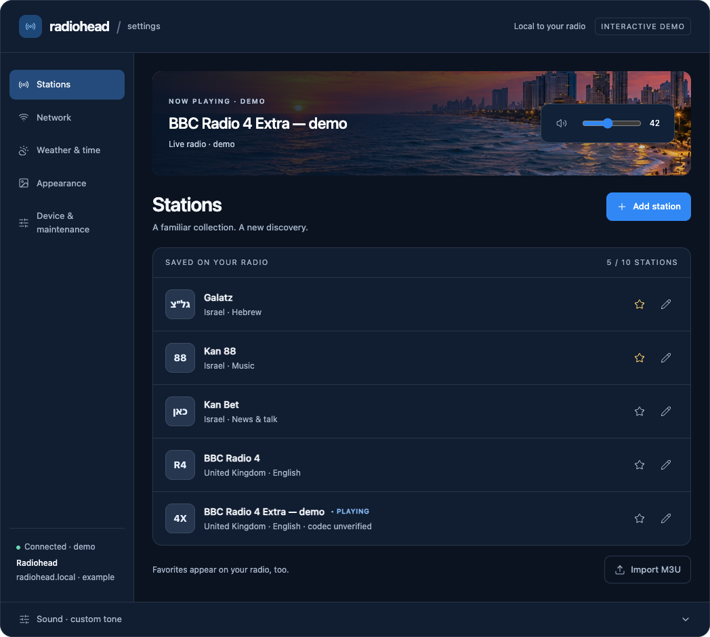
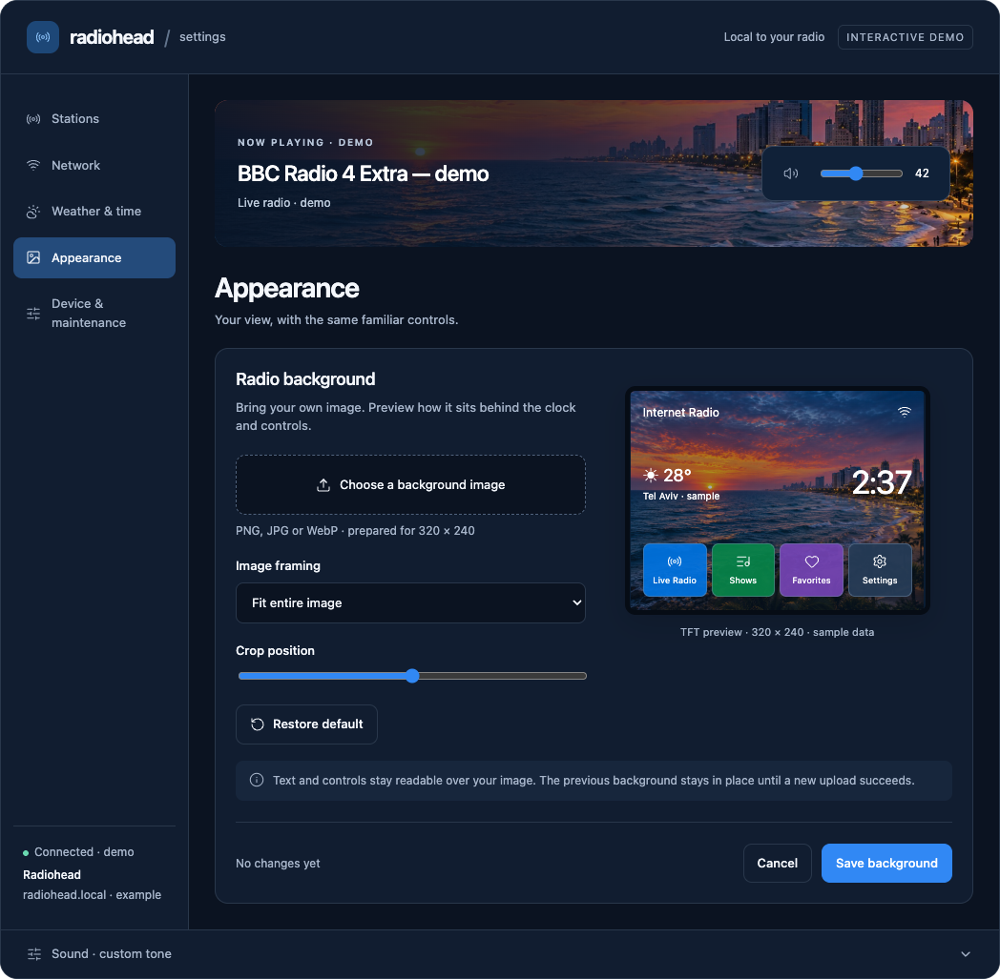

# Radiohead web configuration: implementation handoff

Date: 2026-09-21. Scope: the ESP32-hosted web configuration interface.

Implement the navy/coastal web mockup from the current design task. This handoff
contains the visual specification, screen content, interaction requirements,
reusable CSS, and a separate progress ledger. It does **not** claim that the
firmware has these capabilities today. Read [progress.md](progress.md) before
working and update it when handing off.

## 1. Sources and precedence

1. The user's explicit instructions and
   [configuration-and-controls-plan.md](../configuration-and-controls-plan.md)
   govern retained features, removals, placement, physical controls, and TBD power.
2. [station-discovery-and-artwork-plan.md](../station-discovery-and-artwork-plan.md)
   governs search, artwork identity, image preparation, and storage.
3. This document and [radiohead.css](radiohead.css) govern the new web interface.
4. [The frozen interactive mockup](reference/mockup-fragment.html) and the PNGs
   below establish appearance and flow intent, not production behavior or values.
5. [visual-contract.md](../visual-contract.md) continues to govern the native TFT.

The new web design is the companion to the existing TFT sunset/navy/blue design.
It supersedes the old web page's orange/cyan/yellow controls. It does not supersede
the retained-feature rules or authorize redesigning the TFT.

### Visual references





[Phone reference](reference/mobile.png). The fragment is an archived conversation
mockup, not a standalone firmware page. It has simulated results, optional host
helpers, and embedded imagery; do not deploy its JavaScript or copy its data model.
The screenshots include a sample station added while checking the flow.

## 2. Deliverables and boundaries

Build five web sections in this order: **Stations, Network, Weather & time,
Appearance, Device & maintenance**. Stations is the default landing page. Preserve
existing useful show browsing/playback routes, but do not add a Recorded Shows
configuration section until editable sources actually exist.

Every section shares the brand header, section navigation, connection context,
now-playing/volume/mute strip, and collapsed **Sound · custom tone** control group.
On mobile, section navigation becomes a five-item row above the content.

Do not add alarms, EQ presets, sleep timers, brightness adjustment, idle-clock
mode, visualizer controls, language selection, station/favorite reordering,
configuration backup/restore, or color editing. Do not add placeholders or
“Coming soon” rows for them. Standby/power-off and device renaming remain outside
this implementation; their scope is TBD/future in the controlling plan.

Automatic dimming, supported prepared theme selection, and touch calibration stay
on the TFT. The web may explain where to find calibration, but cannot calibrate
the screen by clicking in the browser. Weather units/visibility and custom tone
must stay consistent with their TFT equivalents.

### Differences between the mockup and production

| Mockup detail | Production requirement |
| --- | --- |
| “Interactive demo”, sample stations, −52 dBm, timestamps and addresses | Replace with actual state. Never seed sample stations or manufacture status. |
| Volume 0–100 | Existing `/setvol` accepts indices **0–21**. Use that bounded index and existing `volCurve` mapping. Label it “Volume”; do not silently change the audio curve. |
| Tone −10…10, labelled dB | Existing `/seteq` accepts **−15…15** for each band. Preserve values and bounds. Use numeric levels unless the installed library's dB interpretation is verified. |
| Instant successful test/save/connect/update | Render request, validation, actual completion, failure and reconnect states from real responses. |
| Sample `.example` URLs and canned search results | Only real directory results or user-entered stream URLs. Do not invent endpoints. |
| A short illustrative timezone list and Tel Aviv default | Support the implemented timezone set with friendly names and search/filter if needed. Use `Asia/Jerusalem` for new and untouched legacy-placeholder installs, preserve explicitly configured non-placeholder zones, and do not infer location from artwork. |
| Every sample Wi-Fi network requires eight characters | Use scanned security type. Open networks have no password. Preserve intentional empty/unchanged/clear semantics for saved credentials. |
| One provider rendered as a selector | Show the supported provider as text when there is only one; do not invent alternatives. |
| Mockup image input limit of 8 MB and M3U limit of 256 KB | These are demo checks, not device budgets. Apply the discovery plan's artwork limits; specify and test independent background/import budgets before enabling uploads. |
| Background and artwork held in browser memory | Convert, validate, commit atomically on device and verify after reboot. Persist crop/fit results, not just preview CSS. |
| Design controls: light companion, corners, failure scenarios | Review aids only. Ship the navy design. Do not expose these as product settings. |
| Proposed reset-scope dialog | Finalize actual reset keys/assets and match the copy exactly before wiring reset. Preserve calibration by default. |

## 3. Visual specification

Use [radiohead.css](radiohead.css) as the starting stylesheet, not an inspiration
to recreate loosely. Keep its `rh-` classes and `#rh-config` scoping unless a
documented implementation constraint requires adapting them.

### Palette and typography

| Token | Value | Use |
| --- | --- | --- |
| `--rh-bg` | `#0b1321` | Page and input background |
| `--rh-panel` | `#111d30` | Sidebar, forms, lists |
| `--rh-raised` | `#17263c` | Secondary controls and subtle panels |
| `--rh-line` | `#29374b` | One-pixel separators |
| `--rh-text` | `#f4f7fc` | Primary text |
| `--rh-dim` | `#a7b5ca` | Secondary text; still readable |
| `--rh-blue` | `#3188f4` | Sliders and active accents |
| `--rh-action` | `#1768ce` | Filled primary action with white text |
| `--rh-radius` | `14px` | Main panels and banner |

The action fill is slightly darker than the mockup's accent to improve small white
label contrast. Do not change all blue accents to this darker fill. Keep selected
navigation navy-blue (`#1c3d66`), favorites gold, errors red and success green.
Pair color with text/icon state. Avoid bright colored outlines on every card.

Use a local/system sans-serif stack. Inter is optional only when bundled locally;
offline setup must not depend on font downloads. Body 14px / 1.5; headings 29px,
18px and 15px; secondary copy 12–13px. Use 400 for normal text and 500–650 for
hierarchy. Editable fields are at least 16px on touch screens. Preserve readable
Hebrew and mixed text using `dir="auto"` or `<bdi>` around user/provider names.
URLs remain left-to-right. No interface-language setting is implied.

### Layout

- Full browser page: center a shell up to 1180px; navy fills the surrounding page.
  Use natural document scrolling. No fixed-height content frame.
- Header: brand at left, compact real connection context at right. The demo badge
  must not appear in firmware.
- Desktop: 197px sidebar; remaining width is the main area with 27px padding.
  Sidebar links have one white line icon and a text label. Device name/address sit
  at the bottom of the sidebar, not in a separate dashboard tile.
- Main area: compact now-playing banner, page heading/subtitle/action, then one
  list or a short vertical sequence of form panels. Never put the photo behind
  text inputs or full forms. Avoid invented metrics or promotional panels.
- Stations: 44px artwork, name and one secondary line, favorite and edit controls.
  Use a shared panel with horizontal dividers. No drag handles or reorder UI.
- Form panels: 21px padding, 18px column gap, about 19px between fields; labels
  above inputs. Save/Cancel sits at the bottom of its editing unit. One visually
  primary action per group. Do not nest unnecessary cards.
- At 780px and below: sidebar narrows to 165px, main padding becomes 20px, paired
  form columns stack, and volume wraps below the now-playing title.
- At 560px and below: sidebar becomes the five-item navigation row; content
  padding is 16px; heading actions wrap naturally. All sections must fit at 320px.
  Mobile labels are Stations / Network / Weather & time / Appearance / Device.
- Dialogs: light surface over a dimmed page, dark text, neutral Cancel and an
  action-colored confirmation. Use the provided viewport overlay adaptation or
  a native modal dialog so long pages cannot hide the dialog above the user.

### Photography, icons, and assets

`assets/coast.jpg` is a 960×720 web derivative of the repository's `docs/bg1.png`.
Preserve the coastline/sunset identity and the banner's navy left-to-right veil.
Keep real image detail visible at the right. The web banner uses the bundled
photo; uploading a custom TFT background does not silently restyle the web page.

CSS resolves `./assets/coast.jpg` relative to the stylesheet; preserve that asset
relationship in firmware URLs, or change this single token during packaging.
Serve the photo as a separate cacheable asset. Do not inline the mockup's large
Base64 image into each HTTP response. Record its bytes and flash impact.

Use consistent local line icons, approximately 17px with 1.7px strokes. The
mockup used Lucide-style radio, Wi-Fi, cloud/sun, image, sliders, star, edit,
upload, chevron, volume, trash and refresh icons. Bundle a small licensed SVG
subset locally or reuse an equivalent existing icon set; no CDN requirement.
Decorative icons have `aria-hidden="true"`; icon buttons have action-specific
accessible names, such as “Edit Kan 88” and “Remove Kan 88 from favorites”.
Use actual saved station artwork when available; initials are the honest fallback.

## 4. Screen content and behavior

### S0 — Shared shell and sound

- Brand: `radiohead / settings`. Show actual device name/address and connection
  state. Support connected, reconnecting, disconnected and setup-mode states.
- Player: **Now playing**, current source name and useful metadata. Show
  **Nothing playing**, **Connecting…**, **Muted** or a stream error when true.
  Do not label recorded playback “Live”. Long mixed-language titles must wrap.
- Volume/mute: sliders send bounded values through existing media ownership.
  Coalesce rapid input; avoid one flash write for every pointer pixel. Update
  other open surfaces from committed state. Mute preserves the selected volume
  and stream; turning while muted keeps mute on, as in the encoder contract.
- **Sound · custom tone** is collapsed by default below the page. Expand to Bass,
  Mid and Treble only. Changes use the actual −15…15 bounds. Live audio preview
  is allowed; show failures and debounce persistence. No presets or “Flat” button.
- Navigation does not pause, restart, or retune playback. Browser Back/Forward
  must work. Guard modified forms before changing section or leaving the page.

### S1 — Stations

Heading **Stations**; subtitle **A familiar collection. A new discovery.** Primary
action **Add station**. List heading **Saved on your radio**, with **N / 10 stations**.
Footer **Favorites appear on your radio, too.** and **Import M3U**.

Each row shows artwork, station name, available country/language or metadata, an
optional **Playing** marker tied to identity, favorite toggle and edit action.
Do not manufacture metadata absent from saved/provider data. Favorites update
without navigating; failure restores the prior state and explains what happened.

Empty: **No saved stations. Add your first station above.** Full: **All 10 slots
are full. Edit or remove a saved station to make room.** Disable Add at capacity;
existing edits and removal remain available. Check capacity again at commit.

**F1 — Discover → review → test → save**

1. Heading **Find your next station**; subtitle **Search without interrupting
   what’s playing.** Steps **1 · Find → 2 · Review & test → 3 · Save**.
2. Tabs **Search directory** / **Enter manually**. Search fields: Station name,
   optional Country and Language, explicit **Search**. No search-as-you-type
   requirement. Enter submits search. Apply the discovery plan's limits,
   mirror failover, stale-request cancellation and identity ranking.
3. Results: **Suggested matches**, name, available country/language/codec and logo.
   Directory results are suggestions; health flags are not device playback proof.
   Ambiguous results require selection. Distinguish no matches from network error.
4. Editor heading **Make it yours** or **Edit station**. Fields: Station name,
   Stream URL, optional Logo URL, **Upload a station logo**, artwork preview,
   Image framing (**Fit with padding**, **Center crop**), Add to favorites.
   Helper: **Use a direct audio stream, not a station’s website.** All fields
   remain independently editable; a later search never overwrites edited fields.
5. Show **Test on radio changes playback. Browsing, editing and saving keep your
   current station playing.** Explicit **Test on radio** action, with Not tested,
   Testing, Playing and Failed states based on device feedback. Changed stream
   details invalidate the old test result. Test is optional, not an invented save
   prerequisite. A missing logo must not prevent a valid station from being saved.
6. **Cancel** / **Save station**. Save acknowledges durable station persistence;
   separately report artwork failure and retry. No silent success or retune.
   Retain the draft after failures. Concurrency follows section 5.

No-match copy: **No matching stations found. Try another name or enter a stream URL
manually.** Directory-outage copy: **The station directory is unavailable. Try again
when internet returns, or enter a stream URL manually.** During AP-only setup,
explain that online discovery needs internet; manual fields and local uploads work.

**F2 — Remove station**

Put **Remove station** at the bottom of the edit page, separate from favorite.
Dialog **Remove {station}?**; explain removal of saved station/favorite/artwork and
the actual playback consequence; **Cancel** / **Remove station**. Default focus
Cancel. Never select an unrelated replacement occupant of the deleted slot.

**F3 — M3U import**

Heading **Import stations**; subtitle **Preview your playlist before adding
anything.** Preserve existing file, pasted/manual and remote-playlist paths where
supported. Provide file selection and pasted content, **Preview import**, names
to be added, duplicate/invalid count, and free-slot count. Default is additive:
keep existing stations. If capacity is exceeded, explain and require correction
before committing; no implicit replacement. Do not reinterpret an HLS segment
playlist as a collection of independent radio stations. Apply the discovery plan's
identity/artwork rules to every import path; imported URLs are not playback proof.

### S2 — Network

Heading **Network**; subtitle **Keep your radio connected.** First panel: actual
network, connection state, signal and reachable local address. Action **Forget
network**. In setup mode show the actual setup SSID and
address, never the sample `Radiohead-Setup` or `192.168.4.1` as unconditional facts.

**F4 — Change Wi-Fi**: scan/select network, **Hidden network…** with exact SSID,
password field when required, **Show password**, **Cancel** / **Connect**.
**Scan networks** must leave current form edits intact. Selecting a result copies
only its SSID into the Network name field; security and password remain manual.
Keep current credentials on an unchanged empty password; selecting Open network
explicitly clears the password. Never echo a saved password back to the browser.

Before Connect show **Changing Wi-Fi restarts the radio. This page will disconnect;
join the new network and reopen the radio’s address.** Save validated credentials,
acknowledge the restart, then reboot without attempting an in-place connection or
previous-network recovery. The next boot attempts only the saved network and falls
back to setup AP if it cannot connect. Forget requires a named confirmation
explaining disconnection and setup recovery, not an optimistic success toast.

### S3 — Weather & time

Heading **Weather & time**; subtitle **A little local context for your radio.**
Weather panel: Location (city/country entry or resolved selection), Units
(Celsius/Fahrenheit), supported provider text, **Show weather on the radio’s Home
screen**, collapsed **Provider access** with an API-key field and explicit clear
action if supported. Placeholder when configured: **Configured · enter a new key
to replace**. Empty input keeps the old key; never return it in page/state/logs.

Clock panel: **Time zone**, friendly region/city names, **Clock format** with
**24-hour · 14:37** and **12-hour · 2:37 PM** examples. Explain that this is the
weather location's time zone and also drives the radio clock. Automatically match
only unambiguous supported `city,country` locations; otherwise retain an explicit
region choice. Regional zones must handle daylight saving with the device's actual
time implementation; no fixed-offset substitution.

One **Cancel** / **Save changes** applies the weather/time editing unit. Validate
before committing; make partial outcomes explicit if backend atomicity is
unavailable. Distinguish saved configuration from a successful weather refresh.
Keep stale/unavailable weather and unsynchronized clock states honest on the TFT.
Avoid restarting the radio simply to save weather when live application is
supported; if a restart is actually required, state it before the action.

### S4 — Appearance

Heading **Appearance**; subtitle **Your view, with the same familiar controls.**
Panel **Radio background**: **Choose a background image**, Image framing
(**Fill screen · crop to fit**, **Fit entire image**), crop-position control, a
4:3 TFT preview, **Restore default**, **Cancel** / **Save background**.

**F5 — Upload background**: choose → decode/validate → frame → preview → save →
acknowledge actual durable device commit. Show the native 320×240 composition
with text/controls overlaid separately; do not bake the sample clock/weather/tiles
into uploaded pixels. Disable crop position when it has no effect in fit mode.
Restore default edits the draft until Save; Cancel restores the saved preview.

Required helper: **The previous background stays in place until a new upload
succeeds.** Invalid file, unsupported format, interrupted upload, full storage and
reboot must preserve the last valid background. Explicit errors retain the draft
for retry. Background identity/storage is separate from station logos. Keep navy
surfaces, white text and blue active states legible on light or busy uploads.

### S5 — Device & maintenance

Heading **Device & maintenance**; subtitle **Updates and the details behind the
music.** About panel: real device name, firmware/build, hardware and web address.
No rename field. Technical details are secondary, under **Open diagnostics**:
network/stream errors, memory/storage, service timing, touch diagnostics and logs.
Show **Not measured** when absent. Never return credentials or claim calibration
can be performed here. Avoid speculative advanced controls without a real need.

**F6 — Firmware update**: **Choose firmware .bin → Review update → Update
firmware**. Review filename, size and any verified compatibility info. Validate
before writing. Show actual writing progress and completion, then reboot/reconnect
state; share progress with TFT. Copy: **Keep power connected until the update is
complete.** Do not treat upload completion as firmware installation success.
Disable conflicting storage/power actions while writing. Handle invalid files,
write failure, disconnect, reboot and successful version re-read.

**F7 — Restart**: **Restart radio? Playback will stop while the radio restarts.
Your stations, Wi-Fi and settings will be kept.** Cancel / Restart. Wait for
actual reconnect before reporting success.

**F8 — Factory reset**: visually separate from Restart. Name the data/keys/assets
actually erased; preserve touch calibration by default. The mockup proposed
Wi-Fi, station/favorite, weather/preference, custom artwork/background erasure
and restoration of the bundled background. Record the final reset policy in
[progress.md](progress.md) before enabling this action. Do not use a generic
“Are you sure?” or imply reset is the TBD standby/power-off behavior.

## 5. Shared UX and accessibility contract

- Multi-field forms maintain saved state and a separate draft. Show **No changes
  yet**, **Unsaved changes**, **Saving…**, **Saved** or a specific failure. Cancel
  discards draft edits, never clears committed credentials or assets.
- A navigation guard offers **Cancel** / **Discard changes**. Do not discard on
  unrelated device updates, incoming directory responses, or connection loss.
- Read shared entity/settings revisions. A stale save keeps the user's draft and
  reports **These settings changed on the radio while you were editing.** Offer
  an explicit reload/review path, clearly warning that reload discards the draft.
  Never silently overwrite a newer TFT or other-browser change. Recheck identity
  at artwork upload commit, not only when opening the editor.
- Use semantic forms/labels/buttons. Enter submits relevant forms. Use active-page
  semantics for nav; real `aria-pressed` for toggles. Disabling a control needs a
  visible reason when not obvious. Preserve keyboard focus and native tab order.
- Status text uses `role="status"`/polite live regions; validation uses linked
  inline errors and `aria-invalid`, with focus to the first invalid field.
  Avoid announcing every slider movement from an unrelated live region.
- Focus-visible ring must work on dark/light surfaces and file controls. Modal
  focus begins at Cancel, stays inside, supports Escape, and returns to its trigger.
  Make underlying content inert. Verify keyboard operation at 200% zoom.
- Touch actions have at least 44×44px non-overlapping targets; editable fields
  are at least 16px. At 320px, forms/dialogs wrap without horizontal scrolling.
- Dynamic names and URLs are untrusted text. Escape HTML, validate schemes and
  bounds, and never insert provider SVG/HTML as executable markup.

## 6. CSS integration contract

Load `radiohead.css` once; put all app markup inside `#rh-config`. Add the body
class `radiohead-page` for the standalone page reset. Serve assets from the radio;
this stylesheet does not require a framework, build system, CDN or JavaScript.

```html
<!doctype html>
<html lang="en">
<head>
  <meta charset="utf-8">
  <meta name="viewport" content="width=device-width, initial-scale=1">
  <title>Radiohead settings</title>
  <link rel="stylesheet" href="/ui/radiohead.css">
</head>
<body class="radiohead-page">
  <div id="rh-config">
    <header class="rh-top"><div class="rh-brand">radiohead / settings</div></header>
    <div class="rh-layout">
      <aside class="rh-sidebar"><nav class="rh-nav" aria-label="Settings">
        <button type="button" aria-current="page">Stations</button>
        <!-- Render the other four real section controls. -->
      </nav></aside>
      <main class="rh-main" id="main-content">
        <!-- Shared player, page heading, section form/list, live status. -->
      </main>
    </div>
    <section class="rh-eq"><!-- Custom tone disclosure. --></section>
    <div class="rh-overlay" hidden><!-- Accessible confirmation dialog. --></div>
  </div>
</body>
</html>
```

The `/ui/` URLs above are a proposed asset mapping, not existing firmware routes.
If CSS is served at `/ui/radiohead.css`, serve the included photograph at
`/ui/assets/coast.jpg`. A firmware packaging step can emit compressed flash data
from these sources; do not concatenate large styles/images for each request.
Keep the source CSS authoritative and generated data reproducible. Inspect
flash/RAM and actual response size before choosing the packaging mechanism.

| Component | Classes / state |
| --- | --- |
| Header/navigation | `rh-top`, `rh-brand`, `rh-topmeta`, `rh-layout`, `rh-sidebar`, `rh-nav`; `aria-current="page"` |
| Player | `rh-hero`, `rh-eyebrow`, `rh-playingname`, `rh-playingmeta`, `rh-volume` |
| Page/actions | `rh-main`, `rh-pagehead`, `rh-button`, `rh-primary`, `rh-quiet`, `rh-danger`, `rh-iconbutton` |
| Station list | `rh-list`, `rh-listhead`, `rh-station`, `rh-art`, `rh-stationname`, `rh-stationdesc`, `rh-actions`, `rh-live` |
| Forms | `rh-box`, `rh-field`, `rh-grid2`, `rh-inlinecheck`, `rh-footer`, `rh-formstatus` |
| Search/import | `rh-back`, `rh-steps`, `rh-tabs`, `rh-search`, `rh-result`, `rh-upload` |
| Background | `rh-preview`, `rh-previewtop`, `rh-previewclock`, `rh-previewtiles`, `rh-previewlabel` |
| Feedback | `rh-note` plus `rh-success`/`rh-warning`/`rh-error`; `rh-toast` plus corresponding variant; `rh-field-error` |
| Dialog | `rh-overlay`, `rh-dialog`; `hidden` on the overlay when closed |
| Technical/sound | `rh-data`, `rh-log`, `rh-eq`, `rh-eqgrid` |

Local inline SVG icons inherit currentColor and have scoped sizing. CSS provides
appearance only: behavior, focus management, data validation, busy states and
saved-state synchronization must be implemented. It does not make any firmware
endpoint safe or add unsupported functionality.

## 7. Engineering and ownership

Inspect current source/diffs before each package; this repository has concurrent
font, TFT, media and podcast changes. Read the root AGENTS instructions and use
the firmware skill before changing application source or public headers.

| Module | Responsibility |
| --- | --- |
| `web_server` | Serve assets/UI, validated request handlers, browser upload/OTA feedback |
| `settings` | Persistence, migration, asset commit/lifecycle and revision storage |
| `app_state` | Shared state, identities and bounds |
| `media` | Playback/test/volume/mute ownership; no duplicate player state machine |
| `display` / controller | TFT reflects committed changes and progress; native rendering |
| `device_control` | Physical controls and coordinated restart/power safeguards |
| `main` | Startup/service orchestration only |

Observed on 2026-09-21: `src/web_server.cpp` still builds old inline pages through
`pageStart()`. It has `/stations`, `/edit`, `/setvol`, `/seteq`, `/setweather`,
`/setwifi`, `/scan_data`, M3U paths, `/favorite` and `/update` among other routes.
These observations are not an API design guarantee; reread current handlers.
New mute/timezone/background/discovery/diagnostic contracts must be audited rather
than assumed. Document real methods, parameters, response/failure states and
revision checks as packages are implemented.

Serve core configuration locally with no project backend, runtime AI, CDN fonts
or remote UI scripts. Online directory/weather/streams remain external services;
their outage must not remove manual setup or saved station artwork. All secrets
stay out of pages, response snapshots, logs and browser persistence. Retain
existing endpoint behavior unless explicitly changed by the controlling plan.
Retired alarm/visualizer/color/preset endpoints must not mutate state.

Keep network/image work off the hot audio path. Bound transfers/decoded images,
cancel stale work and serialize conflicting storage operations. Use actual
completion signals. Measure `audio.loop()` / `server.handleClient()` gaps during
search, upload and persistence rather than assuming chunking prevents dropouts.

## 8. Delivery and acceptance

Use packages W0–W8 and checks V/F/H in [progress.md](progress.md). Claim one
bounded package, note overlapping files and dependencies, update the ledger, then
implement. This is a work breakdown, not an instruction to launch parallel agents.

For actual source/config changes run `pio run -e esp32s3` and `git diff --check`,
inspect RAM/flash, and run focused tests appropriate to the changed behavior.
Pure documentation/style-reference work does not require flashing a device.
Do not mark native TFT, audio continuity, persistence or power checks passed from
a browser mockup. Store screenshots from the real web UI at desktop and phone
widths; link device observations separately.

The handoff is ready when assets/CSS/spec are present and internally checked.
The implementation is complete only when retained behavior works, removed
features stay removed, browser visual/function checks pass, and device evidence
closes the corresponding hardware gates. Leave unmeasured gates unverified.

### Handoff provenance

The mockup follows the referenced “Plan TFT and web settings” task and its current
configuration specification. CSS was extracted from that mockup and adapted for
independent page use, focus/error states, local assets and real-page dialogs.
The repository-required TypeSafe skill was read; deterministic controls and
validation need no semantic model. Live documentation reads were unavailable; no
Jev call, runtime AI dependency, firmware build or hardware acceptance is claimed.
